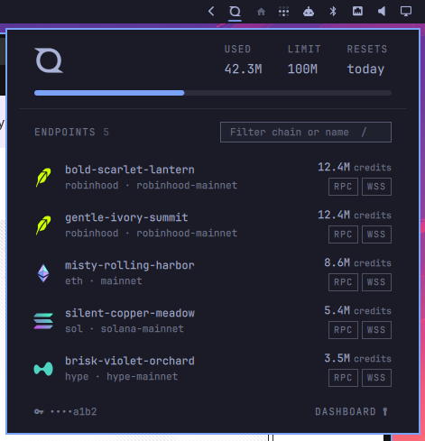

# QuickNode plugin for Omarchy

A bar widget for the [Omarchy](https://omarchy.org) shell that shows your
[QuickNode](https://www.quicknode.com) API credit usage for the current
billing period, with a popup listing your endpoints and their status.



- The bar pill is the QuickNode symbol; it turns urgent when you are near
  (≥90%) or over your plan's credit limit.
- The popup shows credits used / limit, days until the billing period
  resets, a usage progress bar, and overage credits when applicable.
- Below that, every endpoint with its chain logo, chain and network, a
  paused marker, the credits used on that chain this period, and `RPC` /
  `WSS` chips that copy the endpoint URL to the clipboard. Logos are bundled
  in `icons/` (from [web3icons](https://github.com/0xa3k5/web3icons), MIT;
  refresh with `scripts/fetch-icons.sh`); chains without one get a colored
  lettered badge.
- A filter box narrows the list by chain, network, label, or subdomain;
  press `/` to focus it, `Escape` to clear it.
- Left click toggles the popup, middle click refreshes, right click opens
  the popup straight into API key editing.

Data comes from the [QuickNode Admin API](https://www.quicknode.com/docs/quicknode-api)
(`/v0/usage/rpc`, `/v0/usage/rpc/by-chain`, and `/v0/endpoints`), which
requires a paid QuickNode plan. Copying uses `wl-copy`.

The QuickNode symbol in the bar and popup is `assets/quicknode.svg`
(QuickNode's trademark, from their brand assets), recolored at runtime to
the theme foreground with `MultiEffect`.

## Install

```bash
omarchy plugin add https://github.com/sebastienbarrau/qn-plugin.git --enable
```

Or by hand: copy this directory to `~/.config/omarchy/plugins/sebs.quicknode/`,
then run `omarchy-shell shell rescanPlugins` and `omarchy plugin enable sebs.quicknode`.

## Setup

Create a read-only Admin API key in the [QuickNode dashboard](https://dashboard.quicknode.com/api-keys)
(the widget only ever reads usage and endpoints, so it doesn't need write access),
click the widget, and paste the key. The key is stored inline on the
widget's entry in `~/.config/omarchy/shell.json` (plaintext, like all
widget settings) and is sent to `api.quicknode.com` only, via the child
process environment rather than command-line arguments.

## Settings

Settings live inline on the widget's entry in `~/.config/omarchy/shell.json`:

```json
{ "id": "sebs.quicknode", "apiKey": "QN_...", "refreshMinutes": 15 }
```

| Key | Default | Meaning |
|-----|---------|---------|
| `apiKey` | — | QuickNode Admin API key |
| `refreshMinutes` | `15` | How often to poll the Admin API |

## Developing

Files under `~/.config/omarchy/plugins/sebs.quicknode/` are watched, but in
practice edits to `Panel.qml` only took effect after `omarchy restart shell`
— the reload re-registers the widget without re-instantiating the nested
panel. Restart after each change to be sure you're looking at current code.

## IPC

```bash
omarchy-shell sebs.quicknode toggle    # open/close the popup
omarchy-shell sebs.quicknode edit      # open with the key editor focused
omarchy-shell sebs.quicknode refresh   # refetch usage and endpoints
```
